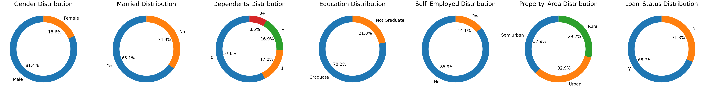
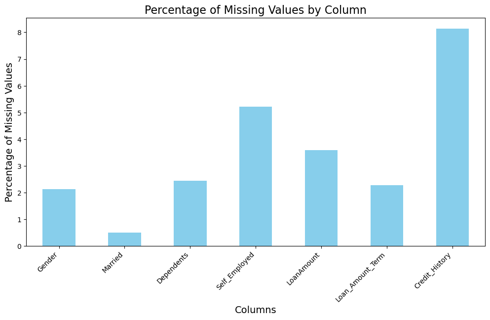

# Loan Approval Prediction Model

This repository contains a loan approval prediction model implemented in a Jupyter notebook. The model predicts loan approvals based on various features of the loan applicants. The notebook includes data cleaning, exploratory data analysis, feature engineering, and model training and evaluation.

## Project Structure

The main components of the project are as follows:

<div class="alert alert-block alert-info">
<h4>Visualization of Categorical Data Distribution</h4>

This segment visualizes the distribution of categorical data in the dataset using pie charts. Each pie chart represents the distribution of values for a particular categorical column. The following steps are undertaken:

1. **Data Preparation**:
   - We select the categorical columns from the DataFrame using `select_dtypes(include='object')`.

2. **Plot Configuration**:
   - We create subplots with one row and as many columns as there are categorical variables. The figure size is adjusted to accommodate all the plots.

3. **Pie Chart Creation**:
   - For each categorical column, we calculate the value counts and plot them as a pie chart. Each pie chart is converted into a donut chart by adding a white circle at the center.

4. **Visualization**:
   - Titles are added to each subplot, and the layout is adjusted to prevent overlapping, ensuring clear and readable visualizations.

The result is a series of pie charts that provide a clear and concise view of the distribution of each categorical variable.


</div>

<div class="alert alert-block alert-info">
<h2>Analysis of Missing Values by Column</h2>

<p>In this analysis, we compute and visualize the percentage of missing values for each column in the dataset. This helps us understand the extent of missing data and identify columns that may require imputation or other preprocessing steps. The following steps outline the process:</p>

<h3>Steps:</h3>
<ul>
  <li><strong>Calculation:</strong> We calculate the percentage of missing values for each column using the <code>isna()</code> method and <code>apply()</code> function.</li>
  <li><strong>Filtering:</strong> We filter out columns with no missing values to focus on those that require attention.</li>
  <li><strong>Visualization:</strong> We create a bar plot to visualize the percentage of missing values for each column, making it easier to identify which columns have significant missing data.</li>
</ul>


</div>

<div class="alert alert-block alert-info">
<h2>Model Training and Evaluation</h2>

This section includes the training and evaluation of different machine learning models to predict loan approvals. The models used include Logistic Regression, Random Forest, and Support Vector Machine (SVM). The performance of each model is evaluated using accuracy, precision, recall, F1 score, and ROC-AUC score.

<h3>Key Metrics:</h3>
<ul>
  <li><strong>Accuracy:</strong> Proportion of correctly predicted instances out of the total instances.</li>
  <li><strong>Precision:</strong> Proportion of true positive instances out of the predicted positive instances.</li>
  <li><strong>Recall:</strong> Proportion of true positive instances out of the actual positive instances.</li>
  <li><strong>F1 Score:</strong> Harmonic mean of precision and recall.</li>
  <li><strong>ROC-AUC Score:</strong> Area under the Receiver Operating Characteristic curve, indicating the ability to distinguish between classes.</li>
</ul>

</div>
<div class="alert alert-block alert-info">

## Evaluating Random Forest

- **Precision:** Random Forest achieved a precision of 0.7647, indicating 76.47% accuracy in predicting loan approvals.

- **Recall:** The recall score for Random Forest is 0.9750, correctly identifying 97.50% of actual loan approvals.

- **F1 Score:** With an F1 score of 0.8571, Random Forest demonstrates a balanced performance between precision and recall.

- **ROC-AUC Score:** Random Forest achieved an ROC-AUC score of 0.7084, indicating moderate ability to distinguish between loan approvals and rejections.

### Confusion Matrix:

|          | Predicted Negative | Predicted Positive |
|----------|--------------------|--------------------|
| **Actual Negative** | 19                 | 24                 |
| **Actual Positive** | 2                  | 78                 |

This matrix provides insight into correct and incorrect predictions made by the Random Forest model.

## Evaluating Support Vector Machine

- **Precision:** Support Vector Machine (SVM) achieved a precision of 0.7619, accurately predicting 76.19% of loan approvals.

- **Recall:** SVM demonstrated perfect recall (1.0000), correctly identifying all actual loan approvals in the dataset.

- **F1 Score:** The F1 score for SVM is 0.8649, indicating a strong balance between precision and recall.

- **ROC-AUC Score:** SVM achieved an ROC-AUC score of 0.7093, indicating moderate discrimination ability between loan approvals and rejections.

### Confusion Matrix:

|          | Predicted Negative | Predicted Positive |
|----------|--------------------|--------------------|
| **Actual Negative** | 18                 | 25                 |
| **Actual Positive** | 0                  | 80                 |

This matrix shows the distribution of correct and incorrect predictions by the SVM model.

## Evaluating Logistic Regression

### Evaluation Metrics:

- **Precision:** Logistic Regression achieved a precision of 0.7596, indicating 75.96% accuracy in predicting loan approvals.

- **Recall:** The recall score for Logistic Regression is 0.9875, correctly identifying 98.75% of actual loan approvals.

- **F1 Score:** With an F1 score of 0.8587, Logistic Regression demonstrates a balanced performance between precision and recall.

- **ROC-AUC Score:** Logistic Regression achieved an ROC-AUC score of 0.7031, indicating moderate ability to distinguish between loan approvals and rejections.

### Confusion Matrix:

|          | Predicted Negative | Predicted Positive |
|----------|--------------------|--------------------|
| **Actual Negative** | 18                 | 25                 |
| **Actual Positive** | 1                  | 79                 |

This matrix provides insight into correct and incorrect predictions made by the Logistic Regression model.

## Interpretation and Model Selection

### Comparison:

Among the three models, SVM stands out with perfect recall (100.00%), meaning it correctly identifies all loan approvals. Although its precision (76.19%) is slightly lower than Random Forest (76.47%) and Logistic Regression (75.96%), SVM achieves a higher F1 score (0.8649) and comparable ROC-AUC score (0.7093). This indicates that SVM offers the best balance between correctly identifying loan approvals and generalizing to new data.

### Why Choose SVM:

1. **High Recall:** SVM's ability to capture all actual loan approvals without missing any is crucial for minimizing false negatives, which are costly in loan approval scenarios.

2. **Balanced Performance:** With a strong F1 score and moderate ROC-AUC score, SVM shows consistent performance across different evaluation metrics.

3. **Robustness:** SVM's robustness to handle complex decision boundaries and its effectiveness in high-dimensional spaces make it suitable for the dataset characteristics typically seen in loan prediction tasks.

Therefore, considering its excellent recall and balanced performance metrics, SVM is selected as the preferred model for predicting loan approvals in this scenario.

</div>## Getting Started

To get a copy of this project up and running on your local machine, follow these steps.

### Prerequisites

- Python 3.11
- Jupyter Notebook
- Required Python libraries (listed in `requirements.txt`)

### Installation

1. Clone the repository:
   ```bash
   git clone https://github.com/Dariusking20/Loan_Data/loan-approval-prediction.git
